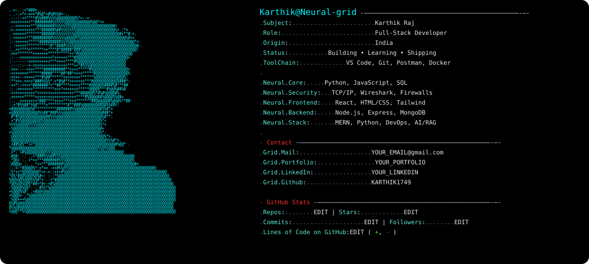

# karthikraj02 — GitHub Profile README


## Preview

<picture>
  <source media="(prefers-color-scheme: dark)" srcset="dark.svg">
  
</picture>

## ✏️ Edit your profile

The visible profile text is directly editable in `dark.svg` and `light.svg`. Search for these labels and replace their values:

- `Subject` — your name
- `Role` — your role
- `Origin` — your location
- `Status` — your current status
- `ToolChain` — your tools
- `Neural.Core` — programming languages
- `Neural.Security` — networking/security skills
- `Neural.Frontend` — frontend skills
- `Neural.Backend` — backend skills
- `Neural.Stack` — MERN, Three.js, Framer Motion, Vercel
- `Grid.Mail` — karthikraj9000@gmail.com
- `Grid.Portfolio` — Portfolio (URL not listed on the resume)
- `Grid.LinkedIn` — karthik
- `Grid.Github` — GitHub username
- `GitHub Stats` — keep editable; the resume does not provide GitHub counts

## Resume-grounded profile details

- MSc Computer Science (2024–2026), Mahatma Gandhi Memorial College — CGPA 6.11
- BSc Computer Science and Statistics (2021–2024), Mahatma Gandhi Memorial College — CGPA 6.73
- Full-stack development: React.js, Node.js, Express.js, MongoDB, Razorpay, Vercel
- Security/networking: TCP/IP, Wireshark, VMware, cryptographic systems
- Key projects: Wormhole — Secure LAN File & Message Sharing; ProTech — E-Commerce Platform (Live)
- Certifications: Infosys Springboard Information Security, Udemy Cyber Security, Splunk Cybersecurity Awareness, Splunk Fundamentals

## 🖼️ Portrait

`portrait.txt` contains the editable ASCII portrait generated from the supplied photo. You can replace it with another ASCII portrait and regenerate the SVG with:

```bash
python ascii_to_svg.py
```

> The profile card is intentionally implemented as SVG so the terminal typography, spacing, colors, and ASCII portrait remain visually consistent on GitHub. The text itself remains editable source code.

## Files you will edit most often

| File | Purpose |
|---|---|
| `dark.svg` | Main editable terminal profile card and all visible text |
| `light.svg` | Light-mode fallback; kept visually identical to the dark design |
| `portrait.txt` | Editable ASCII portrait source |
| `ascii_to_svg.py` | Converts `portrait.txt` into SVG tspans |

**Fastest way to customize:** open `dark.svg`, search for `Subject`, `Role`, `Origin`, `Status`, `ToolChain`, `Neural.Core`, `Contact`, and `GitHub Stats`, then replace the values.
